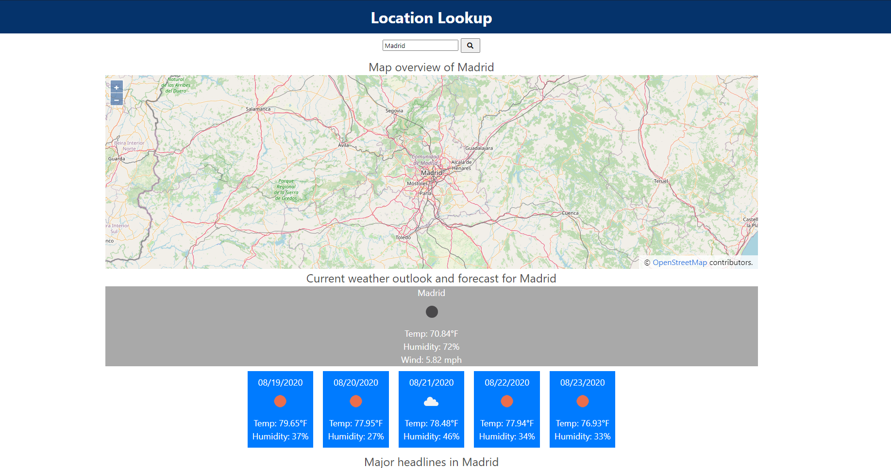

# Location Lookup

Deployed Link: https://nardacyon.github.io/LocationLookup/

This application, Location Lookup was developed for users who want to find information based on a user query input. By searching a city or any given location the application will display a map, weather forecast, and trending news headlines.

This is aimed towards users that are interested in exploring what goes on in certain areas and explore different regions.

Resources used are from the Bing News Search API v7, OpenStreetMap, and OpenWeatherMap. 
For our CSS Framework, we used Bulma.io

Some improvements can be the coordinates for the map, the OpenStreetMap has some errors in its data but some things that we can do is to take the query and have the coordinates saved in an array if the query results are faulty.

As for UI the news card can be formatted better for readability and presentation.
